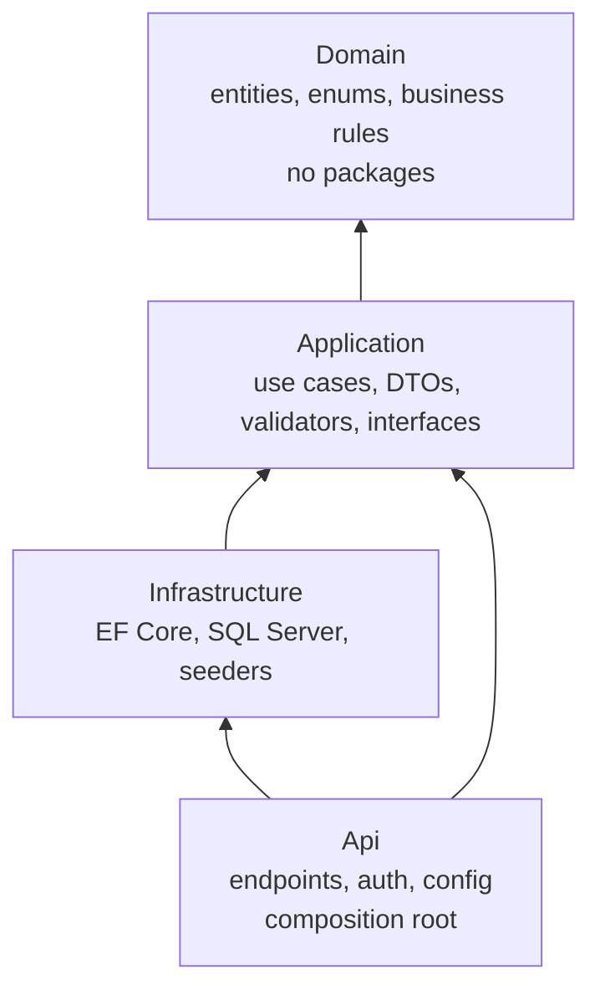
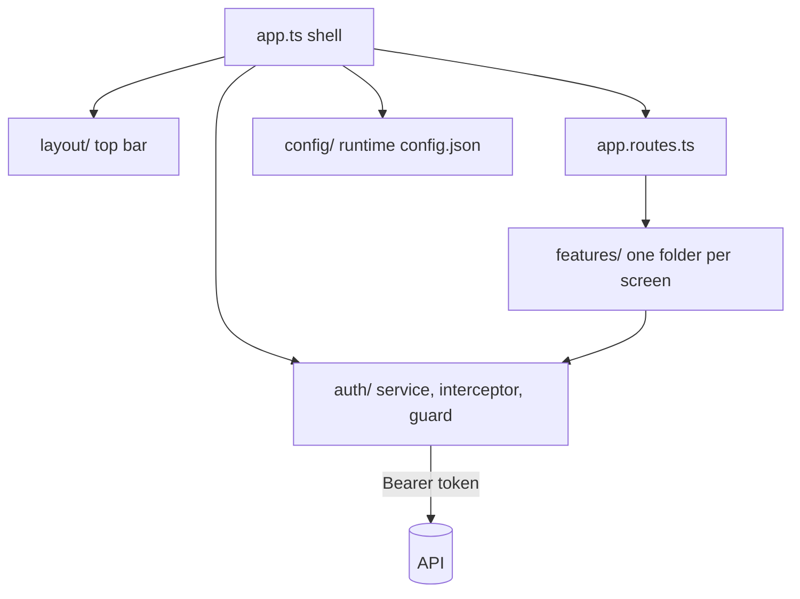

# Layers (Clean Architecture)

Dependencies point inward. Domain depends on nothing.

```mermaid
flowchart BT
    Domain["Domain<br/>entities, enums, business rules<br/>no packages"]
    Application["Application<br/>use cases, DTOs, validators, interfaces"]
    Infrastructure["Infrastructure<br/>EF Core, SQL Server, seeders"]
    Api["Api<br/>endpoints, auth, config<br/>composition root"]

    Application --> Domain
    Infrastructure --> Application
    Api --> Application
    Api --> Infrastructure
```

## Web app shape

```mermaid
flowchart TD
    app[app.ts shell] --> layout[layout/ top bar]
    app --> routes[app.routes.ts]
    routes --> features[features/ one folder per screen]
    app --> auth[auth/ service, interceptor, guard]
    app --> config[config/ runtime config.json]
    features --> auth
    auth -- "Bearer token" --> api[(API)]
```
